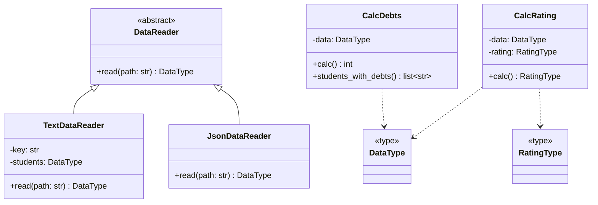

# UML-диаграмма классов

Подробнее: [docs/uml.md](docs/uml.md)

```mermaid
classDiagram
    class DataReader {
        <<abstract>>
        +read(path: str) DataType
    }

    class TextDataReader {
        -key: str
        -students: DataType
        +read(path: str) DataType
    }

    class JsonDataReader {
        +read(path: str) DataType
    }

    class CalcRating {
        -data: DataType
        -rating: RatingType
        +calc() RatingType
    }

    class CalcDebts {
        -data: DataType
        +calc() int
        +students_with_debts() list~str~
    }

    class DataType {
        <<type>>
    }

    class RatingType {
        <<type>>
    }

    DataReader <|-- TextDataReader
    DataReader <|-- JsonDataReader
    CalcRating ..> DataType
    CalcDebts ..> DataType
    CalcRating ..> RatingType
```